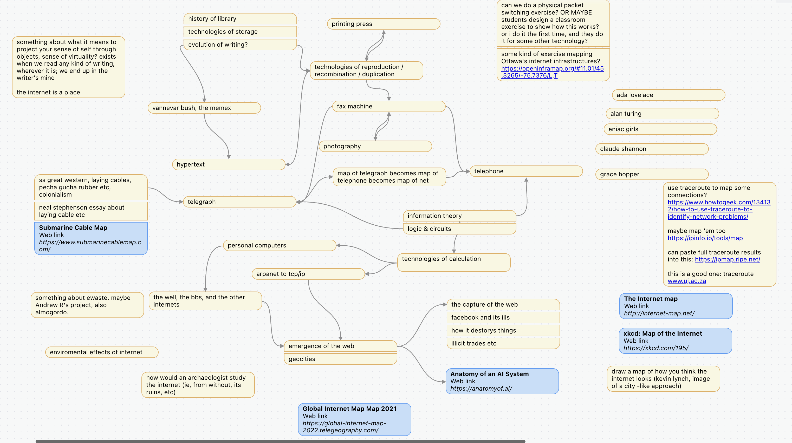

</img> The image at left is the original sketch for this course. I was trying to plot out the elements and ideas that I thought were important for you to know, how they might interrelate, and the kinds of supporting exercises we might do that will help you make sense of this material.

## Part One

The prehistory of the net; information storage and retrieval technologies; libraries; scriptoria and printing presses

January 9th: Introduction; core concepts; overview of assessment

January 11: Archaeology, History, and the Internet: ways of seeing
	-**have the tutorial level completed for today**

January 16: Technologies of Information Storage & Retrieval

January 18: **in class exercise** Obsidian & Github - Your Own Personal Memex

January 23: Technologies of Reproduction

January 25: Book Lab?

January 30: Book Lab?

February 1st: **in class exercise** Publish Your Memex

## Part Two

The first internet: the telegraph; the telephone; photography & faxes; teletype; girdling the world in cables; information theory; impacts on time and space

February 6: Technologies of Reproduction II - photography and the fax machine

February 8: **in class exercise**

February 13: The first internet: the telgraph

February 15: The telegraph, the telephone, and the people's network

February 27: Laying cable & colonialism

March 1st: **in class exercise** information theory

## Part Three

Simulating the weather, simulating the bomb; the first digital computers; emergences of the web; capturing the internet; ewaste; software eats the world

March 6: Babbage & Lovelace & Other Antecedents

March 8: Technologies of calculation

March 13: Ballistics, the Bombe, Enigma, Colossus, etc

March 15: Postwar computing, or, how to play nicely together (timesharing)

March 20: **in class exercise** on the principles of networks

March 22: ARPANet, TCP/IP

March 27: Many internets (and things that look like the web)

March 29: Environmental Impacts

April 3: Emergence of the Web

April 5: The Web is a Place: Social, Cultural impacts of ad-tech
	- **Have your final version of your Memex online and ready to be assessed.**

April 10 and April 12 are blank slots to be used elsewhere in the schedule in case of need. And if we don't need them, they'll be times where you can come to class for extra help with the final assignment.
