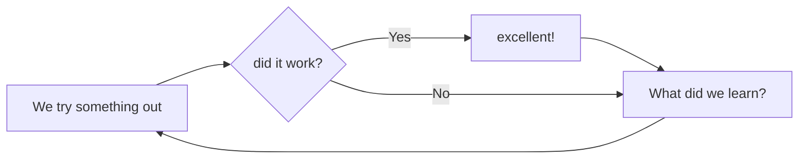

# Assessment

According to section 2 of FASS Undergraduate Teaching Regulations and Procedures, this course outline constitutes a contract between you the student, and me, the professor. However, the word ‘syllabus’ (aka, the course outline), it seems is based on a misreading of a misprint of the greek word ‘sittybis’, meaning a **table of contents**. A table of contents is not a contract. Nevertheless, let us have a contract thus:

> I, Professor Graham, agree to undertake to the best of my abilities, the task of challenging, guiding, and fostering in you, a deeper appreciation, awareness, and understanding for the ideas discussed in this class. You, for your part, agree to undertake the necessary intellectual work to meet me halfway, bringing your best abilities to bear, endeavouring to be receptive and prepared for all course-related activities. Together, we agree to create a community of learning and practice, such that true learning may occur.

## Grade Breakdown

- Tutorial level: 5% - **January 11**
- First Evaluation of your Memex: 10%  - **February 10**
- Second Evaluation of your Memex: 20% - **March 10**
- Third Evaluation of your Memex: 30% - **April 10**
- Final Journey: 35% - **April 27**

Work accepted until midnight on the relevant dates.

See the [[Personal Memex]] page for parameters and grading for the evaluations and the Final Journal.

## Engagement

I’m not grading ‘participation’. Instead, I’m recommending that you come to class **engaged**. (Thank you to [Mark Sample](https://twitter.com/samplereality/status/1564016056208949249) for sharing his thoughts on what engagement means). Let’s understand ‘engagement’ to mean things like -

-   you’ve read and thought about the readings
-   you’ve put your phone away, you’ve turned off notifications while we meet
-   you listen actively to your comrades when they speak (you **hear** them, including what _isn’t_ said, rather than use the time to think up what _you’ll_ say)
-   you refer to specific examples from the readings, the discussions
-   you make connections between what you hear, read, say, and do
-   you practice [scholarly generosity](https://kfitz.info/generous-thinking-introduction/)

Engagement isn’t graded, either. If you’re engaged, it’ll show up in your other work. If you’re not, that’ll show up too. Your move.