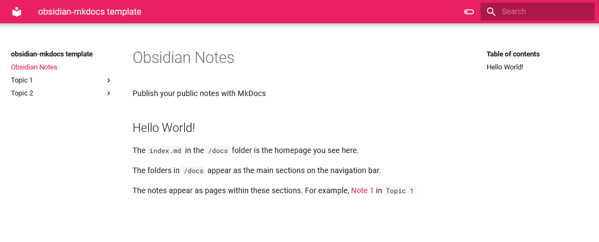
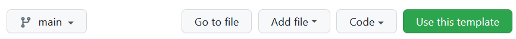
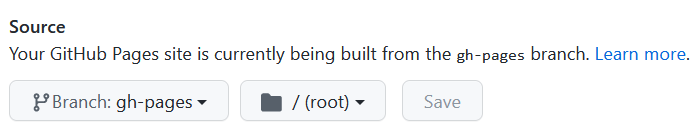

# Publish your Obsidian Notes

(MkDocs template)

Would you like to take _some_ of your notes in [Obsidian](https://obsidian.md/) and make it public?

This template gives you an easy (and automated) way to publish your Obsidian notes on your Github pages.

With this template, you get these **out-of-the-box**:

- an awesome website based on Material theme, complete with a search bar (Checkout this template repo published [here](https://jobindjohn.github.io/obsidian-publish-mkdocs/))

- get the Obsidian/Roam style `[[wikilinks]]` from your vault in your published notes
- Toggle between light and dark mode

## Quick start

1. Create a **new github repository using this template**. Click the green button at the top or use [this link](https://github.com/jobindjohn/obsidian-publish-mkdocs/generate). 

2.  **Give a name** to your repository. By default your notes will be published at `<https://username.github.io/repo-name/>`
     - Copy only the `main` branch while creating the repo from the template
3. **Clone** the repository you generated **into your Obsidian folder/vault.**
4. **Move your notes** that you would like to make public to the `repo-name/docs` folder.
    - Easiest way to do this would be using drag and drop within Obsidian
5. Commit and **push** the changes. Github actions will take care of the rest, publishing your notes using [MkDocs](https://www.mkdocs.org/), with the [Material theme](https://squidfunk.github.io/mkdocs-material/). 
6. Go to `Settings > Pages` and select the select the **Source** as your `gh-pages` branch.

**Not working for you?** Open an [issue](https://github.com/jobindjohn/obsidian-publish-mkdocs/issues/new/choose) and let me know what went wrong.

## Configuring your website

### How do I arrange notes as sections and pages?

By default, the sections and pages will follow the folder structure within `/docs`. The folders and sub-folders will show up as sections. Try not to have white spaces in your folder and file names, as these will be converted to HTML links. The webpage heading will be the same as the first-level heading in the markdown note.

