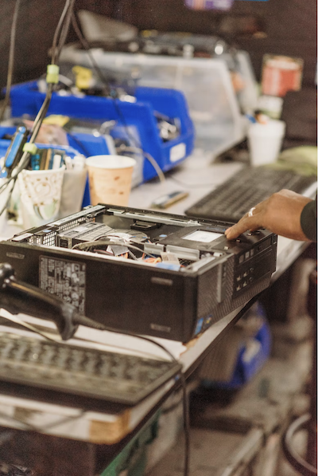

# HIST1900C The History of the Internet

HIST1900C, Winter 2023, [Carleton University](https://carleton.ca/history)
Taught by [Shawn Graham](https://shawngraham.github.io). M, W @ 1.05 pm - 2.25 pm, in [LA C164](https://carleton.ca/tls/rooms/loeb-c164/).

### The Big Idea

</img> The ‘history of the internet’ is more than the history of a particular package of technologies. It’s a story about power, people, culture, and materials. The ‘internet’ isn’t a _thing_, it’s a _place_ and since time and space are unified, it’s an _age_. What is an appropriate frame to study the internet, and once we’ve decided on that, _what might we see?_ I’m not sure where this will take us – but wherever we go, the journey will change how you think about the world. [My background is in archaeology](https://shawngraham.github.io): this will be a self-consciously *archaeological* investigation

HIST1900c is a hands-on lecture based class. By ‘hands on’ I mean you will in fact build things in this class. I will lecture to set the scene. What happens next is up to you.

### Do I have to be techy to get anything out of this course?

In a word, **no**! You do have to be willing to be comfortable with experimentation, with things that break, and with asking for help from your peers or from the prof. You *will* develop some familiarity with a variety of techs, including the [Obsidian](https://obsidian.md) integrated thinking environment, and the [Github](https://github.com) code sharing website.

### Academic Goals

My goals for you are that you will develop

-  Familiarity with some different frameworks for studying this history
-  Contextualized understanding of technical/scientific advances in their cultural milieu
-  Ways of studying this material that take advantages of the affordances of networked ways-of-thinking
- Facility with personal knowledge management approaches

### Get Started

Before class begins in January, [please complete the tutorial level](https://shawngraham.github.io/tutorial-levels/src/hist1900c-tutorial.html) (5% of your grade). The tutorial will walk you through setting up your Github account, and installing (and using) Obsidian on your machine. Then, you can try to [[Set Up Your Own Website]] using Obsidian and Github in tandem.

Make sure you read through and understand these materials: 

[[1.Policies]]

[[2.Schedule]]

[[Assessment|3.Assessment]].

_[Photo by Elly Filho, Unsplash.com](https://unsplash.com/photos/uKB4O22KMMk)_

_Site is built using [[colophon|mkdocs.]]_

 _The ARPAnet in 1970_ via [https://networks.skewed.de/net/internet_top_pop](https://networks.skewed.de/net/internet_top_pop) The datasets can be opened with [graph-tool](https://graph-tool.skewed.de/).